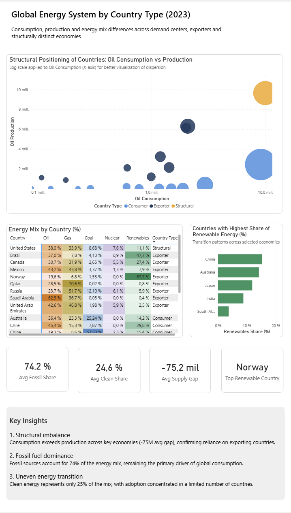

# 🌍 Global Energy System Analysis (2023)

## 📊 Overview
This project analyzes the structural dynamics of the global energy system, focusing on consumption, production, and energy mix across key countries.

The analysis is based on a curated sample of economies representing:
- Major demand centers
- Energy exporters
- Structurally differentiated energy systems

## 🎯 Objective
To understand how energy consumption patterns differ across countries depending on their structural role in the global energy system.

## 📈 Key Insights
- Structural imbalance between demand and supply across major economies
- Fossil fuels remain dominant (~74% of global energy mix)
- Energy transition is uneven and concentrated in specific countries
- Exporters play a critical role in sustaining global consumption

## 🧠 Methodology
- Dataset: Our World in Data (Energy)
- Year: 2023
- Data cleaning and filtering for consistency
- Country classification:
  - Consumer
  - Exporter
  - Structural

## 📸 Dashboard Preview

## 🔄 Iteration & Improvements

The dashboard was redesigned to address key analytical and structural limitations identified in the initial version:

### Initial Issues
- Lack of a clear analytical focus
- Fragmented visual structure
- Overuse of ranking charts without added insight
- Weak KPI definition and prioritization

### Improvements Implemented
- Defined a central analytical question to guide the analysis
- Introduced a primary visual (scatter plot) to capture structural relationships
- Simplified layout to improve readability and narrative flow
- Refined KPIs to better reflect energy system dynamics

### Outcome
The final version provides a more coherent analytical narrative, enabling clearer interpretation of structural differences across countries.

## 📂 Files
- `global_energy_dashboard.pbix` → Full Power BI dashboard
- `/docs` → Technical documentation and analysis process

## 👤 Author
Laura Agostina Spena  
Data Analyst (Power BI | SQL | Data Storytelling)
